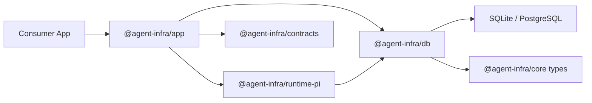

# System Architecture

The platform is intentionally split into durable truth, application orchestration, runtime execution, and consumer apps.

## Layering rules

- `core` owns semantics
- `contracts` own transport shapes
- `db` owns persistence implementation
- `app` owns use-case orchestration
- `runtime-pi` owns runtime execution mapping
- consumer apps own UI and transport glue

## Why separate docs and playground

The docs site should explain the stable platform.

The playground should pressure-test it.

Keeping those roles separate makes both better:

- docs remain public, stable, and deployable
- the playground can move quickly without becoming the documentation source of truth
