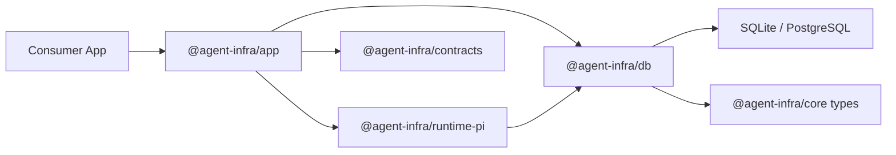

# 系统架构

整个平台被明确拆成 durable truth、应用编排、runtime execution 和 consumer apps 四层。

## 分层规则

- `core` 负责语义
- `contracts` 负责 transport shapes
- `db` 负责持久化实现
- `app` 负责 use-case orchestration
- `runtime-pi` 负责 runtime execution mapping
- consumer apps 负责 UI 与 transport glue

## 为什么要把 docs 和 playground 分开

文档站应该负责解释稳定的平台边界。

playground 则应该负责对这些边界施加真实压力。

把两者分开会让它们都更好：

- docs 保持公开、稳定、可部署
- playground 可以快速演进，而不会反过来成为文档真相源
