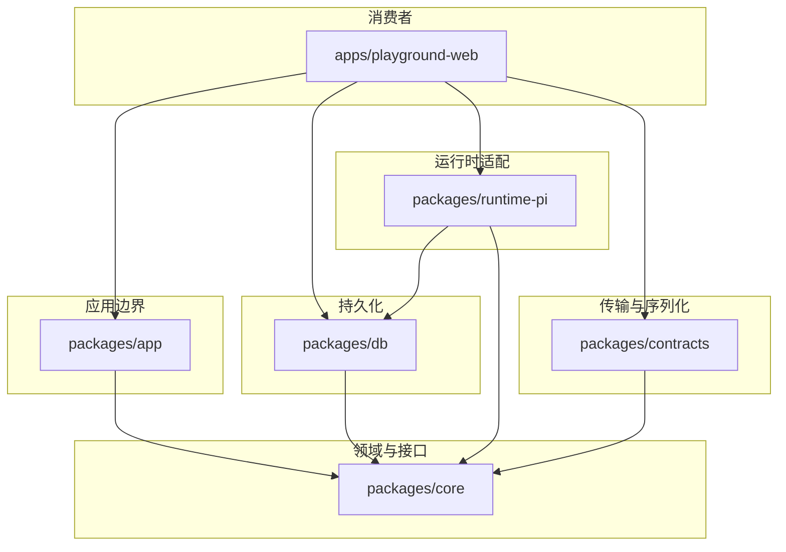

# agent-infra 项目说明书（中文）

本文面向**第一次接触本仓库的初级程序员**：说明仓库在做什么、`packages` 与 `apps` 里每个包/应用的职责，以及你需要优先认识的**主要类型、函数与类**。阅读时建议配合根目录的 [`AGENTS.md`](../AGENTS.md) 中的构建命令使用。

---

## 1. 这个项目是干什么的？

**agent-infra** 是一套为「智能体（Agent）运行时」服务的**可持久化后端基础设施**，而不是一个完整的聊天产品。

- **持久化**：对话不是只在内存里飘一下，而是落到数据库里（线程、消息、运行记录、工具调用、运行事件等）。
- **分层**：领域类型与仓储接口在 `core`；应用层编排（建线程、发一轮文本等）在 `app`；具体数据库实现在 `db`；某一种具体 LLM 运行时（Pi）的适配在 `runtime-pi`；HTTP/浏览器可序列化的形状在 `contracts`。
- **第一个消费者**：`apps/playground-web` 用来演示和调试，**业务编排规则不应写死在 playground 里**，而应放在 `app` 等库层。

---

## 2. 仓库与 pnpm 工作区

根目录使用 **pnpm workspace**，在 [`pnpm-workspace.yaml`](../pnpm-workspace.yaml) 中声明：

- `packages/*`：可复用的库包。
- `apps/*`：可运行的应用（当前主要是 Next.js 前端）。

根 [`package.json`](../package.json) 常用脚本：

| 命令 | 作用 |
|------|------|
| `pnpm dev` | 启动 `playground-web` 本地开发 |
| `pnpm build` | 构建所有 workspace 包 |
| `pnpm typecheck` | 按依赖顺序构建部分包后，全仓库 TypeScript 检查 |
| `pnpm test` | 运行各包中声明了 `test` 脚本的测试 |

---

## 3. 分层关系（一眼看懂）

**数据流直觉（文本一轮对话）**：

1. 前端调用 API → 使用 `contracts` 里的 DTO 作为请求/响应形状。
2. 服务端组装 `App` 依赖（`db` 的仓储 + `runtime-pi` 的运行时）→ 调用 `createAgentInfraApp`。
3. `app` 在事务里写入用户消息、创建 `run`（排队），再调用 `runtime.runTextTurn` 执行模型与工具。
4. `runtime-pi` 把 Pi Agent 的事件流翻译成 `message` / `message_part` / `run_event` / `tool_invocation` 等记录。

---

## 4. `packages` 各包说明

### 4.1 `@agent-infra/core`（`packages/core`）

**职责**：**纯领域模型**——类型定义 + 仓储（Repository）**接口**，不包含任何数据库或 HTTP 实现。

**主要导出**（`src/index.ts` 导出 `types` 与 `repositories`）：

#### 领域类型（`src/types.ts`）

| 名称 | 含义（给初学者的直觉） |
|------|------------------------|
| `Thread` | 一条「对话线程」，可挂多个 run、多条消息；比「session」更贴近长期时间线。 |
| `Run` | 一次模型执行过程（含 provider、model、状态 `queued/running/completed/...`）。 |
| `Message` | 一条消息（user/assistant/system/tool），带 `seq` 排序。 |
| `MessagePart` | 一条消息可拆成多段：文本、工具调用、工具结果、推理、结构化 data 等。 |
| `RunEvent` | 某次 run 的**追加只读**事件日志（seq 递增），用于保留运行时真相。 |
| `ToolInvocation` | 工具调用记录（名称、状态、输入输出等）。 |
| `Artifact` | 附件/产物占位（v0.1 中接口存在，路线图里会扩展）。 |

#### 仓储接口（`src/repositories.ts`）

| 接口 | 主要方法 |
|------|----------|
| `ThreadRepository` | `create`、`findById`、`listByApp` |
| `RunRepository` | `create`、`findById`、`updateStatus` |
| `MessageRepository` | `create`、`updateStatus`、`createPart`、`listByThread`、`nextSeq` |
| `RunEventRepository` | `append`、`listByRun`、`nextSeq` |
| `ToolInvocationRepository` | `create`、`updateStatus`、`listByRun` |
| `ArtifactRepository` | `create`、`findByThread` |

**学习建议**：先理解 `Thread` → `Message` + `MessagePart` → `Run` 的关系，再理解 `RunEvent` 与 `ToolInvocation` 如何围绕一次 `Run` 展开。

---

### 4.2 `@agent-infra/app`（`packages/app`）

**职责**：**窄应用边界**——编排「线程」与「一轮文本对话」等用例，依赖 `core` 的接口，通过注入的 **仓储**、**事务**、**运行时端口** 完成工作。

**入口函数**：

| 函数 | 作用 |
|------|------|
| `createAgentInfraApp(dependencies)` | 工厂函数，返回 `AgentInfraApp` 实例，封装所有用例。 |

**返回对象 `AgentInfraApp` 的结构**（`src/types.ts`）：

| 命名空间 | 方法 | 说明 |
|----------|------|------|
| `threads` | `create` | 创建线程（需 `appId` 等）。 |
| `threads` | `list` | 按 `appId` 列出线程。 |
| `threads` | `getMessages` | 读取某线程下消息（含 parts）。 |
| `turns` | `runText` | **核心**：用户发一段文本 → 持久化用户消息与排队 run → 调用 runtime 执行 → 返回投影结果。 |
| `runs` | `getTimeline` | 按 `runId` 取 run、run_events、tool_invocations 时间线。 |

**需要认识的类型**：

| 类型 | 作用 |
|------|------|
| `AgentInfraAppDependencies` | 注入 `repositories`、`runtime`、`transaction`，可选 `idGenerator`、`now`。 |
| `AgentInfraRuntimePort` | 运行时端口：`prepare`（解析 provider/model）、`runTextTurn`（执行一轮）。 |
| `RunTextTurnInput` / `RunTextTurnResult` | 文本轮次的输入与输出（含 `executionError`、`debug` 计数）。 |

**错误类**（`src/errors.ts`）：均继承 `AgentInfraAppError`，带 `statusCode`、`code`、`context`。

| 类名 | 典型场景 |
|------|----------|
| `ThreadNotFoundError` | 线程不存在 |
| `RunNotFoundError` | Run 不存在 |
| `ThreadNotActiveError` | 线程已归档等非 active |
| `InvalidTurnTextError` | 空文本 |
| `RuntimeUnavailableError` / `RuntimeSelectionError` | 运行时不可用或模型选择失败 |
| `TurnPersistenceError` / `TurnProjectionError` | 持久化或投影读取失败 |

**其它导出**：`defaultIdGenerator`（`src/index.ts`）为默认 UUID 生成器。

---

### 4.3 `@agent-infra/contracts`（`packages/contracts`）

**职责**：定义**可序列化**的 DTO（日期为 ISO 字符串），供 HTTP API、浏览器端与 `core` 领域对象对齐，**不承载业务逻辑**。

**常见 DTO 类型**（`src/index.ts` 所在模块）：

| 类型 | 含义 |
|------|------|
| `ThreadDto`、`RunDto`、`MessageDto`、`MessagePartDto` | 与领域对象对应，时间字段为 `IsoDateString`。 |
| `ToolInvocationDto`、`RunEventDto` | 工具与事件 |
| `CreateThreadRequestDto`、`RunTextTurnRequestDto` 等 | 请求体形状 |
| `ThreadsResponseDto`、`RunTextTurnResponseDto`、`RunTimelineResponseDto` 等 | 响应体形状（常带可选 `error`） |
| `RuntimePiMetaDto`、`RuntimePiModelOptionDto` | Playground 展示运行时与模型元信息 |

**关系**：`contracts` 依赖 `core` 的**联合类型**（如 `MessageRole`、`RunStatus`），保证枚举一致。

---

### 4.4 `@agent-infra/db`（`packages/db`）

**职责**：**Drizzle ORM** + **PostgreSQL / SQLite** 两种实现；提供表结构、仓储实现类，以及事务辅助。

**主要导出**（`src/index.ts`）：

| 模块 | 内容 |
|------|------|
| `./client` | `createDbConfigFromEnv`、`withDbTransaction`、`DbConfig` |
| `./repositories` | `Drizzle*` 仓储类（PostgreSQL 用 `schema.ts`） |
| `./repositories-sqlite` | `Sqlite*` 仓储类（SQLite 用 `schema-sqlite.ts`） |

**关键函数**：

| 函数 | 作用 |
|------|------|
| `createDbConfigFromEnv()` | 若存在 `TURSO_DATABASE_URL` 则用 Turso/libSQL；否则若存在 `DATABASE_URL` 则用 Postgres；否则用 `SQLITE_PATH`（默认 `./local.db`）并 `initialize` 时建表。 |
| `withDbTransaction(config, operation)` | 统一事务：SQLite 用队列串行化 + `BEGIN IMMEDIATE`；Postgres 用 Drizzle 事务。 |

**主要仓储类**（Postgres / SQLite 各一套，接口相同）：

- `DrizzleThreadRepository` / `SqliteThreadRepository`
- `DrizzleRunRepository` / `SqliteRunRepository`
- `DrizzleMessageRepository` / `SqliteMessageRepository`
- `DrizzleRunEventRepository` / `SqliteRunEventRepository`
- `DrizzleToolInvocationRepository` / `SqliteToolInvocationRepository`
- `DrizzleArtifactRepository`（如使用）

**表结构**：见 `src/schema.ts`（Postgres）与 `src/schema-sqlite.ts`（SQLite），表名如 `threads`、`runs`、`messages`、`message_parts`、`tool_invocations`、`run_events`、`artifacts`。

---

### 4.5 `@agent-infra/runtime-pi`（`packages/runtime-pi`）

**职责**：基于 **`@mariozechner/pi-agent-core`** 与 **`@mariozechner/pi-ai`**，把 **Pi Agent** 的执行过程**翻译**为 `core` 里定义的持久化记录（消息、片段、事件、工具调用等）。这是当前仓库里**一条主线的服务端运行时适配**。

**入口策略**：

- root 入口 `@agent-infra/runtime-pi`：只暴露 **types** 与 **config helpers**
- 重入口 `@agent-infra/runtime-pi/runtime`：暴露 `createPiRuntime`、`runAssistantTurnWithPi`
- 工具入口 `@agent-infra/runtime-pi/tools`：暴露 `createDemoTools`
- 惰性入口 `@agent-infra/runtime-pi/lazy`：暴露 `createLazyPiRuntime`

这样做是为了让 consumer 在 Next.js 一类会分析服务端模块图的环境里，能把“读路径/首屏路径”和“真正执行 runtime”分开，减少误把重依赖链带进来的概率。

**主要导出**（按入口划分）：

| 符号 | 类型 | 作用 |
|------|------|------|
| `listRuntimePiModelOptions` | 函数 | 从 root 入口导出，列出内置模型选项列表。 |
| `listAvailableRuntimePiModelOptionsFromEnv` | 函数 | 从 root 入口导出，按环境变量过滤可用模型。 |
| `resolveRuntimePiConfigFromEnv` | 函数 | 从 root 入口导出，从环境变量解析 `RuntimePiConfig`。 |
| `createLazyPiRuntime` | 函数 | 从 `lazy` 子路径导出，延迟到真正调用时才加载 runtime 实现。 |
| `createPiRuntime` | 函数 | 从 `runtime` 子路径导出，创建 `RuntimePiRuntime`：`prepare` + `runTurn`。 |
| `runAssistantTurnWithPi` | 函数 | 从 `runtime` 子路径导出，便捷封装：用默认 demo 工具创建 runtime 并 `runTurn`。 |
| `createDemoTools` | 函数 | 从 `tools` 子路径导出，创建演示用 `AgentTool[]`。 |

**`RuntimePiRuntime` 接口**（`src/types.ts`）：

| 方法 | 作用 |
|------|------|
| `prepare(input?)` | 解析出 `provider` + `model`（`RuntimePiSelection`）。 |
| `runTurn(ctx, input)` | 在给定 `RuntimePiContext`（四个 repo）下执行一轮。 |

**`RuntimePiContext`** 包含：`runRepo`、`messageRepo`、`toolRepo`、`runEventRepo`（与 `app` 注入的仓储子集一致）。

**`runtime.ts` 内部要点**（了解即可）：

- 使用 `Agent`（pi-agent-core）订阅事件，在 `handleAgentEvent` 等逻辑里写入 DB。
- 失败时会 `hardenFailureState`、更新 run 状态、追加 `runtime_error` 事件。

**环境变量**（常见）：`DEEPSEEK_API_KEY`、`OPENAI_API_KEY`、`OPENAI_MODEL`；与 `db` 配合时还有 `TURSO_DATABASE_URL` / `TURSO_AUTH_TOKEN`、`DATABASE_URL` 或 `SQLITE_PATH`。

---

### 4.6 `@agent-infra/shared`（`packages/shared`）

**职责**：极小共享工具，目前仅导出 **`now()`**（返回当前 `Date`）。后续可放跨包无业务耦合的纯函数。

---

## 5. `apps` 应用说明

### 5.1 `playground-web`（`apps/playground-web`）

**职责**：**第一个消费者**——Next.js 15 应用，演示：

1. **浏览器本地实验**（首页 `PiExperimentPage`）：与 Pi 生态（如 `pi-web-ui`）相关的交互实验。
2. **带 durable 观察面的聊天参考页**（聊天页 / runtime 相关页）：调用后端 API，走 `createAgentInfraApp` + `runtime-pi` + SQLite/Postgres。

需要特别注意：

- 中间 chat 区按“聊天产品主链路”设计。
- durable 能力仍然保留，但主要放在右侧 log / timeline 观察面里。
- 不应再把这个页面理解成“durable runtime console 优先、聊天区只是附属展示”。
- 更细的运行时 UX 边界见 [`docs/playground-web-chat-runtime-architecture.md`](playground-web-chat-runtime-architecture.md)。

**依赖的 workspace 包**：`@agent-infra/app`、`contracts`、`core`、`db`、`runtime-pi`，以及 Pi 相关 npm 包。

**服务端胶水**：[`lib/runtime-pi-repo.ts`](../apps/playground-web/lib/runtime-pi-repo.ts) 是**关键集成点**：

- `createDbConfigFromEnv()` → `dbReady`
- 按 `dbMode` 选择 `Sqlite*` 或 `Drizzle*` 仓储
- `createPiRuntime({ tools: ... })` 适配为 `AgentInfraRuntimePort`
- `withDbTransaction` 作为 `app` 的 `transaction`
- `createAgentInfraApp(...)` → 导出 **`runtimePiApp`**

**对外 API 路由**（示例）：

| 路径 | 作用 |
|------|------|
| `GET/POST /api/runtime-pi/threads` | 列出/创建线程 |
| `GET /api/runtime-pi/threads/[threadId]/messages` | 消息列表 |
| `POST /api/runtime-pi/runs/[threadId]` | 发起一轮文本（`runText`） |
| `GET /api/runtime-pi/runs/[runId]/timeline` | Run 时间线 |
| `GET /api/runtime-pi/meta` | 运行时与 DB 元信息 |

**DTO 映射**：[`lib/runtime-pi-dto.ts`](../apps/playground-web/lib/runtime-pi-dto.ts) 中的 `toThreadDto`、`toMessageDto`、`toRunDto` 等，把 `core` 的 `Date` 领域对象转为 `contracts` 的 ISO 字符串。

**常量**：线程归属的 `APP_ID` 在路由里写为 `'playground-runtime-pi'`（与「演示应用」绑定）。

---

## 6. 核心概念速查（为什么这样设计？）

以下内容与 [`docs/architecture.md`](architecture.md) 一致，用中文稍作展开：

| 概念 | 说明 |
|------|------|
| **Thread 而非 Session** | 强调**可持久化的时间线**，可包含多次 run 与多条消息。 |
| **Message 拆成 message_part** | 支持混合内容：文本、工具调用/结果、推理、结构化 data，便于扩展。 |
| **run_events** | 追加式事件日志，**保留运行时真实过程**；上层读模型可以只暴露精简投影。 |

---

## 7. 路线图（你在读代码时可能看到「未完成」）

详见 [`docs/roadmap.md`](roadmap.md)：v0.2 流式与可恢复 run、v0.3 产物与文件、v0.4 记忆层等。读代码时若发现 Artifact 等接口较「薄」，属于预期内的演进空间。

---

## 8. 建议阅读顺序（初级程序员）

1. **[`docs/architecture.md`](architecture.md)**（5 分钟）  
2. **`packages/core/src/types.ts`** + **`repositories.ts`**（领域与接口）  
3. **`packages/app/src/app.ts`**（`createAgentInfraApp` 与 `runText` 全流程）  
4. **`apps/playground-web/lib/runtime-pi-repo.ts`**（如何把 db + runtime-pi 接到 app）  
5. **`packages/runtime-pi/src/runtime.ts`** 中 `createPiRuntime` 与 `runAssistantTurnWithPiInternal`（可选，较深）  
6. 任选一个 **`app/api/runtime-pi/.../route.ts`** 看 HTTP 如何调用 `runtimePiApp`

---

## 9. 文档索引

| 文档 | 内容 |
|------|------|
| [`architecture.md`](architecture.md) | 英文架构说明 |
| [`roadmap.md`](roadmap.md) | 版本规划 |
| [`docs/project-manual-zh.md`](project-manual-zh.md) | 本文（中文项目说明书） |
| [`AGENTS.md`](../AGENTS.md) | 仓库命令、风格、提交约定 |

---

*文档版本：与仓库 v0.1 代码结构对应；若包名或导出有变更，请以各包 `package.json` 与 `src/index.ts` 为准。*
